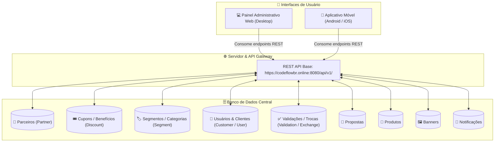
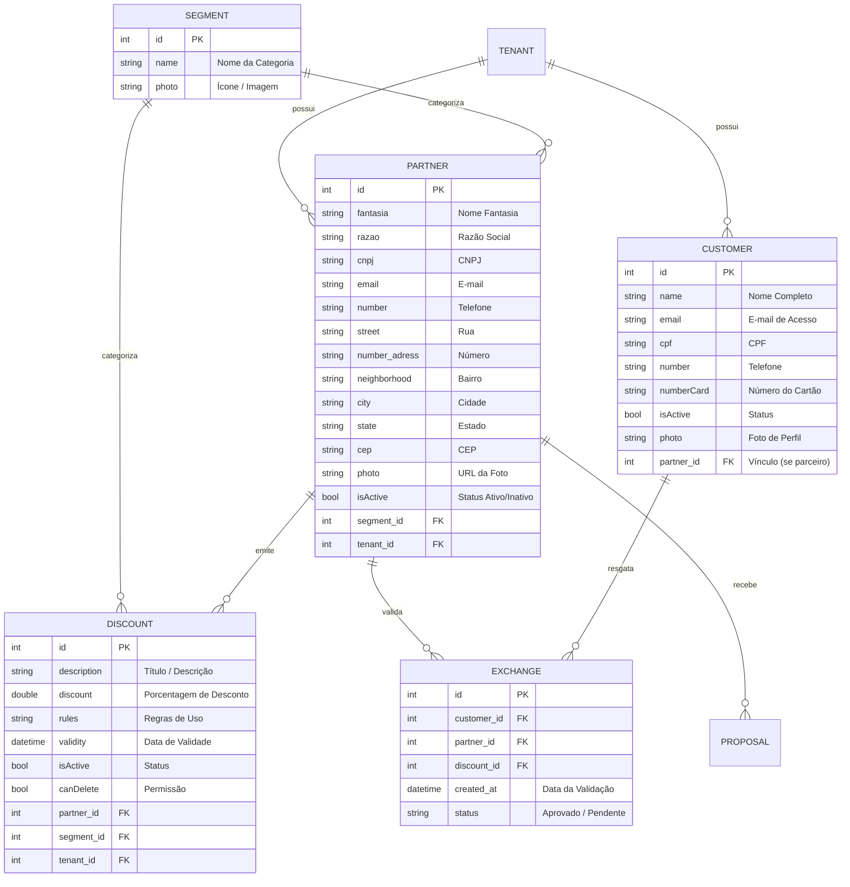
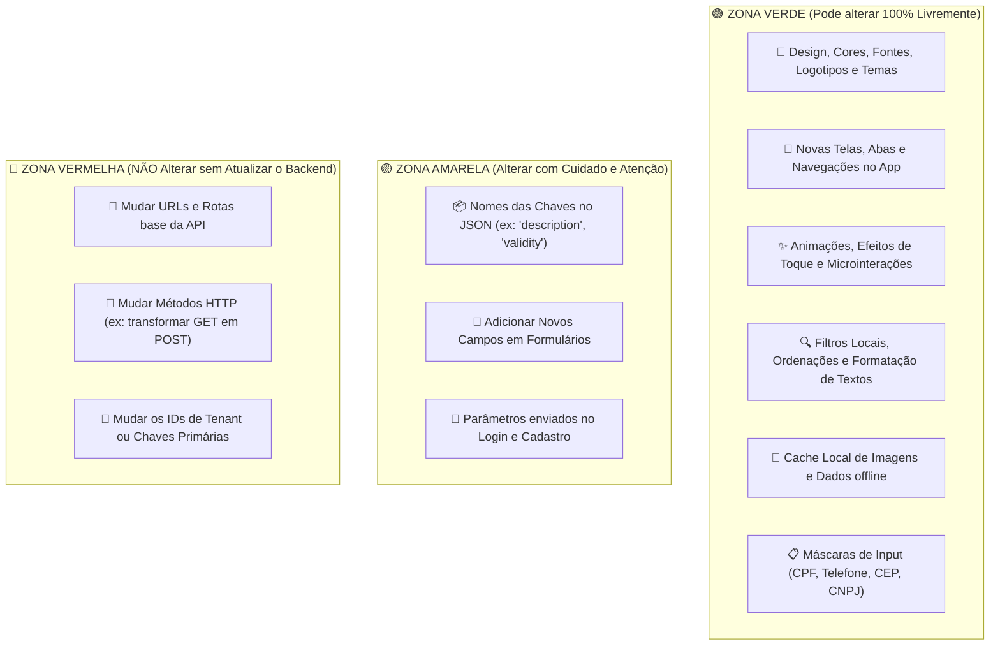

# 🗺️ Mapa de Arquitetura: Banco de Dados, APIs e Guia de Alterações

Este documento descreve detalhadamente a arquitetura atual do sistema **ARMS GYM / Procard**, os relacionamentos do Banco de Dados, o mapa de endpoints da API e o **guia de segurança** para você saber exatamente o que pode ser alterado no App sem gerar problemas.

---

## 1. 🏗️ Visão Geral da Arquitetura



---

## 2. 🗄️ Modelo e Relacionamentos do Banco de Dados (ERD)



---

## 3. 📡 Mapa Completo das APIs

| Módulo | Método | Endpoint | Função / Descrição |
| :--- | :---: | :--- | :--- |
| **Cupons** | `GET` | `/api/v1/discount` | Lista todos os cupons disponíveis |
| **Cupons** | `POST` | `/api/v1/discount` | Cadastra novo cupom |
| **Cupons** | `PUT` | `/api/v1/discount` | Atualiza dados do cupom |
| **Cupons** | `DELETE` | `/api/v1/discount/{id}` | Exclui cupom pelo ID |
| **Cupons Parceiro** | `GET` | `/api/v1/discount/partner/{id}` | Cupons específicos de um parceiro |
| **Validação** | `POST` | `/api/v1/discount/validate` | Valida uso do cupom / QR Code |
| **Parceiros** | `GET` | `/api/v1/partner` | Lista todos os parceiros |
| **Parceiros** | `POST` | `/api/v1/partner` | Cria novo parceiro |
| **Parceiros** | `PUT` | `/api/v1/partner` | Atualiza parceiro (inclui `isActive`) |
| **Parceiros** | `DELETE` | `/api/v1/partner/{id}` | Remove parceiro |
| **Segmentos** | `GET` | `/api/v1/segment` | Lista categorias de segmentos |
| **Segmentos** | `POST` | `/api/v1/segment` | Cria novo segmento |
| **Segmentos** | `PUT` | `/api/v1/segment` | Edita segmento existente |
| **Usuários** | `GET` | `/api/v1/customer` | Lista clientes e usuários |
| **Usuários** | `PUT` | `/api/v1/customer` | Atualiza dados de cliente |
| **Autenticação** | `POST` | `/api/v1/auth/login` | Login com usuário e senha |
| **Autenticação** | `POST` | `/api/v1/auth/forgot-password` | Envia link de recuperação de senha |
| **Banners** | `GET` | `/api/v1/banner` | Lista banners do app |
| **Banners** | `POST` | `/api/v1/banner` | Cadastra banner |
| **Banners** | `DELETE` | `/api/v1/banner/{id}` | Exclui banner |
| **Notificações** | `GET` | `/api/v1/notification` | Lista mensagens/notificações |
| **Notificações** | `POST` | `/api/v1/notification` | Envia push/mensagem para usuários |

---

## 4. 🧭 Guia Prático: O que você pode alterar sem gerar problemas?



### 🟢 1. O que você pode alterar 100% LIVREMENTE no App (Sem risco nenhum ao BD):
* **Toda a Interface Visual**: Redesenhar telas, mudar cores, trocar fontes, criar novos cards de cupom, trocar barras de navegação.
* **Experiência do Usuário (UX)**: Adicionar animações, loading skeletons, botões de ação rápida, busca instantânea.
* **Formatações e Máscaras**: Formatar datas (`DD/MM/AAAA`), formatar CPF (`000.000.000-00`), formatar CNPJ e moedas.
* **Cache de Imagens**: Salvar fotos em cache no celular para o app abrir instantaneamente.

### 🟡 2. O que você deve alterar COM ATENÇÃO (Manter padrão da API):
* **Nomes dos Campos enviados na API**:
  * Ao criar/editar um cupom no app, o JSON deve conter as chaves exatas:
    ```json
    {
      "description": "Título do benefício",
      "discount": 15.0,
      "rules": "Regras de uso no estabelecimento",
      "validity": "2026-12-31",
      "idParceiro": 120,
      "idSegmento": 5,
      "idTenant": 1
    }
    ```
* **Novos Campos**: Se você inventar um campo novo que o backend ainda não salva (ex: *"horaLimite"*), ele precisará ser adicionado no backend antes de persistir no banco.

### 🔴 3. O que NUNCA deve ser alterado:
* As URLs dos endpoints existentes (ex: `/api/v1/discount`, `/api/v1/partner`).
* O formato de autenticação do token JWT.

---

> **Conclusão:** Você tem total liberdade criativa para redesenhar, modernizar e otimizar o App mobile! Basta manter a comunicação com os endpoints da tabela acima para que o banco e o painel web funcionem em perfeita harmonia.
